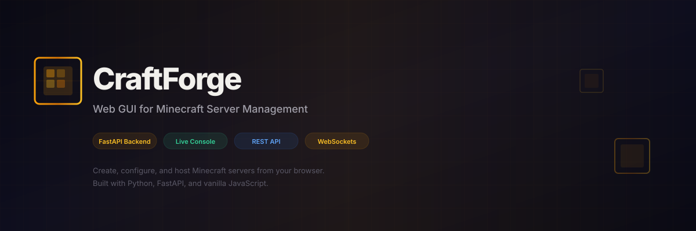

<p align="center">
  
</p>

<p align="center">
  <a href="#features"></a>
  <a href="LICENSE"></a>
  <a href="https://www.python.org/downloads/"></a>
  <a href="https://fastapi.tiangolo.com/"></a>
  <a href="https://minecraft.net/"></a>
</p>

---

A web-based GUI for creating, configuring, and hosting Minecraft dedicated servers. Spin up servers, tweak `server.properties` with a visual editor, stream the live console, and manage everything from your browser — no file editing required.

---

## Features

<table>
<tr>
<td width="50%">

### Server Management
- Create, rename, and delete server instances
- Start, stop, restart with one click
- Live uptime tracking and system resource monitoring

### One-Click Install
- Downloads the latest Minecraft server JAR directly from Mojang
- Auto-accepts the EULA
- No SteamCMD or launcher required

### Live Console
- Real-time output via WebSockets
- Send commands directly to the running server
- Auto-scroll with log-level colorization

### Configuration Editor
- Full `server.properties` visual editor
- Categorized settings with search
- Toggle switches, number inputs, dropdowns for booleans, ints, enums
- Apply preset profiles instantly

</td>
<td width="50%">

### Preset Profiles
| Preset | Description |
|--------|-------------|
| Survival | Standard survival experience |
| Creative | Flight enabled, peaceful mode |
| Hardcore | Hard difficulty, permadeath |
| Peaceful | No mobs, relaxed building |

### REST API
- Full REST API for every operation
- WebSocket streams for console and install progress
- System monitoring endpoints

### Player Tracking
- Live player count detection from log output
- Peak player statistics

### Connection Info
- Auto-detected local and public IP
- Port forwarding hints

### Docker Support
- Ready-to-use `Dockerfile` with Python + Java 17
- `docker-compose.yml` for easy deployment

</td>
</tr>
</table>

---

## Quick Start

```bash
# Clone the repo
git clone https://github.com/JamesCowx/craftforge.git
cd craftforge

# Install dependencies
pip install -r requirements.txt

# Run the application
python main.py
```

Open **http://localhost:8080** in your browser.

### Prerequisites

- **Python 3.11+** — for the web server
- **Java 17+** — for running Minecraft servers (checked automatically during install)

---

## Screenshots

<table>
<tr>
<td width="50%"></td>
<td width="50%"></td>
</tr>
<tr>
<td align="center"><strong>Server Overview</strong> — stats, details, and connection info</td>
<td align="center"><strong>Configuration Editor</strong> — categorized settings with presets</td>
</tr>
</table>

---

## Tutorial: From Zero to a Running Minecraft Server

This tutorial walks you through the entire process — from installing CraftForge to having your friends connect to your Minecraft server.

---

### Step 0: Prerequisites

Before you begin, make sure you have these installed:

| Requirement | How to Check | Where to Get It |
|-------------|-------------|-----------------|
| **Python 3.11+** | `python --version` | [python.org](https://python.org) |
| **Java 17+** | `java -version` | [adoptium.net](https://adoptium.net) (recommended) or `sudo apt install openjdk-17-jre` (Linux) |
| **Git** | `git --version` | [git-scm.com](https://git-scm.com) |

> **Windows users**: Add Python and Java to your system PATH during installation. CraftForge will detect Java via the `JAVA_HOME` environment variable or by searching your PATH.

---

### Step 1: Install CraftForge

Open a terminal and run:

```bash
# Clone the repository
git clone https://github.com/JamesCowx/craftforge.git
cd craftforge

# Install Python dependencies
pip install -r requirements.txt
```

---

### Step 2: Start the Web UI

```bash
python main.py
```

You'll see output like:
```
INFO:     Uvicorn running on http://0.0.0.0:8080
INFO:     (Press CTRL+C to quit)
```

Open **http://localhost:8080** in your browser. You should see the CraftForge dashboard with an empty sidebar and a "No Server Selected" screen.

> **Tip**: For production, use `python run.py` instead — it runs with optimized settings and proxy headers.

---

### Step 3: Create a Server Instance

1. Click **+ New Server** in the sidebar (or press the `N` key)
2. Fill in the modal:
   - **Server Name**: `Survival World` (or whatever you like)
   - **Port**: `25565` (the default Minecraft port)
   - **Max Players**: `20`
3. Click **Create Server**

Your new server appears in the sidebar and is automatically selected. The main view shows the **Overview** tab with placeholder stats.


---

### Step 4: Install Minecraft Server Files

Before you can start the server, you need to download the Minecraft server JAR.

1. Click the **Install & Updates** tab
2. Check the **Java Runtime** status:
   - **Green dot "Java Installed & Ready"** — you're good to proceed
   - **Red dot "Java Not Found"** — install Java 17+ and restart CraftForge
3. Click **Install / Update Minecraft Server**

   The installer:
   - Fetches the latest version manifest from Mojang
   - Downloads the server JAR (~50 MB)
   - Saves it in the server's install directory
   - Auto-accepts the Minecraft EULA
   - Marks the server as installed

4. Wait for the `__COMPLETE__` message in the output panel

After installation, the **Start** button becomes active.

---

### Step 5: Configure Server Settings (Optional)

Click the **Settings** tab to customize your server before starting it:

#### Using a Preset
1. Open the **Apply Preset** dropdown
2. Choose a preset:
   - **Survival** — classic survival mode (easy difficulty)
   - **Creative** — flight enabled, peaceful, no PvP
   - **Hardcore** — hard difficulty, permadeath enabled
   - **Peaceful** — no monsters, relaxed building

   The preset is applied immediately (but not saved to disk yet).

#### Editing Individual Settings
Settings are organized into categories:

| Category | Includes |
|----------|----------|
| **Server** | MOTD, port, max players, online mode, memory allocation |
| **Gameplay** | Gamemode, difficulty, PvP, hardcore, flight, world size |
| **World** | View distance, simulation distance, spawn rates, tick time |
| **Whitelist** | Whitelist toggle, OP permission level |
| **Admin** | Command blocks, RCON, query, JMX monitoring |
| **Resources** | Resource pack URL and SHA1 |

To edit a setting:
- **Toggle** — click the switch for boolean values (e.g., `pvp`, `enable-command-block`)
- **Number** — type a value or use the arrows (e.g., `max-players`, `view-distance`)
- **Dropdown** — select from predefined options (e.g., `difficulty`: Peaceful/Easy/Normal/Hard)
- **Text** — type a string (e.g., `motd` message of the day)

#### Save Your Changes
Click **Save Changes** to write the settings to `server.properties`. Your changes persist across restarts.


---

### Step 6: Start the Server

1. Go back to the **Overview** tab
2. Click the green **Start** button

   CraftForge will:
   - Write the current settings to `server.properties`
   - Allocate memory (default: 2 GB; configurable via `max-memory-gb` in Settings)
   - Launch the JAR with `--nogui` and your configured port
   - Stream all output to the Console tab in real time

3. The status badge changes to **Running** (green) and the stats come to life:
   - **Status**: Running
   - **Uptime**: starts counting
   - **Memory**: shows live RAM usage
   - **Players**: updates as people join

> **First start note**: The first launch generates the world and may take 30–60 seconds. Watch the Console tab for progress.

---

### Step 7: Connect to Your Server

#### On the Same Computer
Open Minecraft Java Edition → **Multiplayer** → **Add Server** → enter:
```
localhost:25565
```

#### On the Same Local Network
Check the **Connection Info** card on the Overview tab. It shows:
- **Local Network**: `192.168.x.x:25565`
- Share this address with players on your Wi-Fi

#### Over the Internet
1. Check the **Internet** address in Connection Info (your public IP)
2. **Port forward** port `25565` TCP on your router to the computer running CraftForge
3. Share `your-public-ip:25565` with friends

> **Need help with port forwarding?** Search "port forwarding [your router model]" or check [portforward.com](https://portforward.com).

---

### Step 8: Manage the Server

#### Live Console
Click the **Console** tab to see the live server output and type commands:

```
/help                  — Show all commands
/list                  — List online players
/say Welcome to the server!  — Broadcast a message
/gamemode creative @a  — Set all players to creative
/kick badplayer        — Kick a player
/op player123          — Grant operator status
/whitelist add player123  — Add to whitelist
/save-all              — Force a world save
/stop                  — Gracefully shut down the server
```

> Commands are sent instantly. Enable **Auto-scroll** to follow new output.

#### Stop & Restart
- **Stop** — sends the `/stop` command to the server (graceful shutdown with 30-second timeout)
- **Restart** — stops then starts the server with a 3-second delay

---

### Step 9: Running Multiple Servers

You can run multiple Minecraft servers on different ports:

1. Click **+ New Server**
2. Give it a different name (e.g., "Creative Build")
3. Use a different port (e.g., `25566`)
4. Install and start independently

Each server has its own:
- Install directory with its own `server.jar`
- `server.properties` configuration
- World data
- Console stream
- Start/stop lifecycle

---

### Step 10: Updating Minecraft

When a new Minecraft version releases:

1. Select your server
2. Go to **Install & Updates**
3. Click **Install / Update Minecraft Server**

The installer downloads the latest server JAR and replaces the old one. Your world data and settings are preserved.

> **Warning**: Back up your world before updating. Some updates may modify world format.

---

### Docker Deployment

For production or server environments, use Docker:

```bash
docker compose up -d
```

This builds an image containing:
- Python 3.11 + CraftForge web server
- Java 17 JRE for running Minecraft

The container exposes:
- **Port 8080** — CraftForge web UI
- **Port 25565** — Minecraft server (configure additional ports for multiple servers)

To manage Docker servers:
```bash
docker compose logs -f    # Follow logs
docker compose stop       # Stop containers
docker compose up -d      # Start again
```

---

## Docker

```bash
docker compose up -d
```

The container exposes:
- **8080** — CraftForge web UI
- **25565** — Minecraft server port

---

## API Reference

### Servers

| Method | Endpoint | Description |
|--------|----------|-------------|
| GET | `/api/servers` | List all server instances |
| POST | `/api/servers` | Create a new server |
| GET | `/api/servers/{id}` | Get server details |
| DELETE | `/api/servers/{id}` | Delete a server |
| PUT | `/api/servers/{id}/rename` | Rename a server |

### Server Lifecycle

| Method | Endpoint | Description |
|--------|----------|-------------|
| POST | `/api/servers/{id}/start` | Start the server |
| POST | `/api/servers/{id}/stop` | Stop the server |
| POST | `/api/servers/{id}/restart` | Restart the server |
| POST | `/api/servers/{id}/command` | Send a console command |
| GET | `/api/servers/{id}/logs` | Get recent log lines |

### Settings

| Method | Endpoint | Description |
|--------|----------|-------------|
| GET | `/api/servers/{id}/settings` | Read `server.properties` |
| PUT | `/api/servers/{id}/settings` | Update `server.properties` |
| GET | `/api/servers/defaults/settings` | Get default settings |
| GET | `/api/servers/defaults/presets` | Get preset definitions |

### Installation

| Method | Endpoint | Description |
|--------|----------|-------------|
| GET | `/api/install/java/status` | Check if Java is installed |
| POST | `/api/install/server/{id}` | Download server JAR (REST) |
| WS | `/ws/install/{id}` | Download server JAR (WebSocket with progress) |
| WS | `/ws/update/{id}` | Update server JAR (WebSocket with progress) |

### Console

| Type | Endpoint | Description |
|------|----------|-------------|
| WS | `/ws/console/{id}` | Live console output stream |

### System

| Method | Endpoint | Description |
|--------|----------|-------------|
| GET | `/api/system` | CPU, RAM, disk info |
| GET | `/api/system/network` | Local and public IP |

### Health

| Method | Endpoint | Description |
|--------|----------|-------------|
| GET | `/health` | Health check |

---

## Project Structure

```
craftforge/
├── main.py                  # FastAPI application entry point
├── run.py                   # Production uvicorn runner
├── requirements.txt         # Python dependencies
├── .env.example             # Environment variable template
├── Dockerfile               # Python + Java 17 image
├── docker-compose.yml       # Docker Compose config
├── api/
│   ├── servers.py           # Server CRUD + lifecycle endpoints
│   ├── install.py           # Java check + REST install
│   ├── console.py           # Live console WebSocket
│   ├── install_ws.py        # Install/update progress WebSocket
│   └── system.py            # System + network info endpoints
├── services/
│   ├── server_manager.py    # Server process management
│   ├── config_manager.py    # server.properties read/write + presets
│   ├── downloader.py        # Mojang API client for server.jar
│   └── system.py            # CPU/RAM/disk/network utilities
└── static/
    ├── index.html           # Single-page application
    ├── craftforge-icon.svg  # App icon
    ├── craftforge-banner.svg # GitHub banner
    ├── css/
    │   └── style.css        # Dark theme stylesheet
    └── js/
        └── app.js           # Client-side application logic
```

---

## Environment Variables

| Variable | Default | Description |
|----------|---------|-------------|
| `HOST` | `0.0.0.0` | Server bind address |
| `PORT` | `8080` | Web UI port |
| `SERVER_DATA_DIR` | `servers/` | Directory for server instances |
| `CORS_ORIGINS` | `*` | CORS allowed origins |
| `LOG_LEVEL` | `info` | Logging level |
| `JAVA_HOME` | *(auto)* | Java installation path |

---

## Tech Stack

- **Backend**: Python 3.11+, FastAPI, Uvicorn, WebSockets
- **Frontend**: Vanilla JavaScript, HTML5, CSS3 (dark theme)
- **Server Runtime**: Java 17+ (Minecraft server JAR)
- **Deployment**: Docker, docker-compose

---

## License

Distributed under the **MIT License**. See [LICENSE](LICENSE) for more information.
