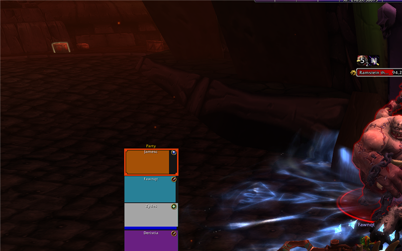
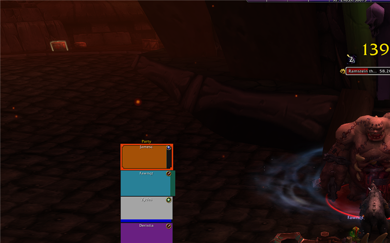

<p align="center">
  
</p>

<p align="center">
  <a href="#features"></a>
  <a href="LICENSE"></a>
  <a href="https://www.python.org/downloads/"></a>
  <a href="https://fastapi.tiangolo.com/"></a>
  <a href="https://minecraft.net/"></a>
</p>

---

A web-based GUI for creating, configuring, and hosting Minecraft dedicated servers. Spin up servers, tweak `server.properties` with a visual editor, stream the live console, and manage everything from your browser — no file editing required.

---

## Features

<table>
<tr>
<td width="50%">

### Server Management
- Create, rename, and delete server instances
- Start, stop, restart with one click
- Live uptime tracking and system resource monitoring

### One-Click Install
- Downloads the latest Minecraft server JAR directly from Mojang
- Auto-accepts the EULA
- No SteamCMD or launcher required

### Live Console
- Real-time output via WebSockets
- Send commands directly to the running server
- Auto-scroll with log-level colorization

### Configuration Editor
- Full `server.properties` visual editor
- Categorized settings with search
- Toggle switches, number inputs, dropdowns for booleans, ints, enums
- Apply preset profiles instantly

</td>
<td width="50%">

### Preset Profiles
| Preset | Description |
|--------|-------------|
| Survival | Standard survival experience |
| Creative | Flight enabled, peaceful mode |
| Hardcore | Hard difficulty, permadeath |
| Peaceful | No mobs, relaxed building |

### REST API
- Full REST API for every operation
- WebSocket streams for console and install progress
- System monitoring endpoints

### Player Tracking
- Live player count detection from log output
- Peak player statistics

### Connection Info
- Auto-detected local and public IP
- Port forwarding hints

### Docker Support
- Ready-to-use `Dockerfile` with Python + Java 17
- `docker-compose.yml` for easy deployment

</td>
</tr>
</table>

---

## Quick Start

```bash
# Clone the repo
git clone https://github.com/JamesCowx/craftforge.git
cd craftforge

# Install dependencies
pip install -r requirements.txt

# Run the application
python main.py
```

Open **http://localhost:8080** in your browser.

### Prerequisites

- **Python 3.11+** — for the web server
- **Java 17+** — for running Minecraft servers (checked automatically during install)

---

## Screenshots

<table>
<tr>
<td width="50%"></td>
<td width="50%"></td>
</tr>
<tr>
<td align="center"><strong>Server Overview</strong> — stats, details, and connection info</td>
<td align="center"><strong>Configuration Editor</strong> — categorized settings with presets</td>
</tr>
</table>

---

## Usage

### Creating a Server

1. Click **+ New Server** in the sidebar (or press `N`)
2. Enter a name, port (default `25565`), and max players
3. The server appears in the sidebar — select it to manage

### Installing Minecraft

1. Select a server, go to **Install & Updates**
2. Ensure Java is detected (green dot)
3. Click **Install / Update Minecraft Server**
4. The JAR downloads from Mojang's servers; the EULA is auto-accepted

### Starting & Stopping

Use **Start**, **Stop**, **Restart** in the header. The server runs as a subprocess; output streams to the web console in real time.

### Editing Settings

The **Settings** tab exposes every `server.properties` option:

- **Categories**: Server, Gameplay, World, Whitelist, Admin, Resources
- **Filter**: Search bar to quickly find any setting
- **Presets**: Dropdown to apply Survival/Creative/Hardcore/Peaceful
- **Controls**: Toggles for booleans, number inputs, dropdowns for gamemode/difficulty
- **Save**: Click **Save Changes** to persist to `server.properties`

### Console

The **Console** tab provides a live terminal. Type any Minecraft server command:

```
/help        — List commands
/list        — Show online players
/say hello   — Broadcast a message
/gamemode creative @a  — Switch everyone to creative
```

---

## Docker

```bash
docker compose up -d
```

The container exposes:
- **8080** — CraftForge web UI
- **25565** — Minecraft server port

---

## API Reference

### Servers

| Method | Endpoint | Description |
|--------|----------|-------------|
| GET | `/api/servers` | List all server instances |
| POST | `/api/servers` | Create a new server |
| GET | `/api/servers/{id}` | Get server details |
| DELETE | `/api/servers/{id}` | Delete a server |
| PUT | `/api/servers/{id}/rename` | Rename a server |

### Server Lifecycle

| Method | Endpoint | Description |
|--------|----------|-------------|
| POST | `/api/servers/{id}/start` | Start the server |
| POST | `/api/servers/{id}/stop` | Stop the server |
| POST | `/api/servers/{id}/restart` | Restart the server |
| POST | `/api/servers/{id}/command` | Send a console command |
| GET | `/api/servers/{id}/logs` | Get recent log lines |

### Settings

| Method | Endpoint | Description |
|--------|----------|-------------|
| GET | `/api/servers/{id}/settings` | Read `server.properties` |
| PUT | `/api/servers/{id}/settings` | Update `server.properties` |
| GET | `/api/servers/defaults/settings` | Get default settings |
| GET | `/api/servers/defaults/presets` | Get preset definitions |

### Installation

| Method | Endpoint | Description |
|--------|----------|-------------|
| GET | `/api/install/java/status` | Check if Java is installed |
| POST | `/api/install/server/{id}` | Download server JAR (REST) |
| WS | `/ws/install/{id}` | Download server JAR (WebSocket with progress) |
| WS | `/ws/update/{id}` | Update server JAR (WebSocket with progress) |

### Console

| Type | Endpoint | Description |
|------|----------|-------------|
| WS | `/ws/console/{id}` | Live console output stream |

### System

| Method | Endpoint | Description |
|--------|----------|-------------|
| GET | `/api/system` | CPU, RAM, disk info |
| GET | `/api/system/network` | Local and public IP |

### Health

| Method | Endpoint | Description |
|--------|----------|-------------|
| GET | `/health` | Health check |

---

## Project Structure

```
craftforge/
├── main.py                  # FastAPI application entry point
├── run.py                   # Production uvicorn runner
├── requirements.txt         # Python dependencies
├── .env.example             # Environment variable template
├── Dockerfile               # Python + Java 17 image
├── docker-compose.yml       # Docker Compose config
├── api/
│   ├── servers.py           # Server CRUD + lifecycle endpoints
│   ├── install.py           # Java check + REST install
│   ├── console.py           # Live console WebSocket
│   ├── install_ws.py        # Install/update progress WebSocket
│   └── system.py            # System + network info endpoints
├── services/
│   ├── server_manager.py    # Server process management
│   ├── config_manager.py    # server.properties read/write + presets
│   ├── downloader.py        # Mojang API client for server.jar
│   └── system.py            # CPU/RAM/disk/network utilities
└── static/
    ├── index.html           # Single-page application
    ├── craftforge-icon.svg  # App icon
    ├── craftforge-banner.svg # GitHub banner
    ├── css/
    │   └── style.css        # Dark theme stylesheet
    └── js/
        └── app.js           # Client-side application logic
```

---

## Environment Variables

| Variable | Default | Description |
|----------|---------|-------------|
| `HOST` | `0.0.0.0` | Server bind address |
| `PORT` | `8080` | Web UI port |
| `SERVER_DATA_DIR` | `servers/` | Directory for server instances |
| `CORS_ORIGINS` | `*` | CORS allowed origins |
| `LOG_LEVEL` | `info` | Logging level |
| `JAVA_HOME` | *(auto)* | Java installation path |

---

## Tech Stack

- **Backend**: Python 3.11+, FastAPI, Uvicorn, WebSockets
- **Frontend**: Vanilla JavaScript, HTML5, CSS3 (dark theme)
- **Server Runtime**: Java 17+ (Minecraft server JAR)
- **Deployment**: Docker, docker-compose

---

## License

Distributed under the **MIT License**. See [LICENSE](LICENSE) for more information.
